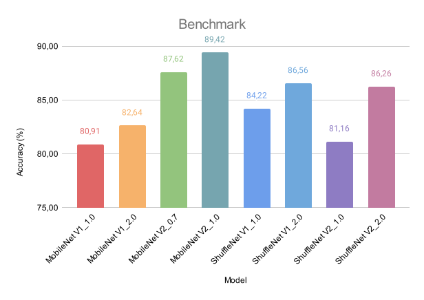

# Benchmark of Light Weight Models for EgoGesture Recognition

## Introduction
The proposed work primarily concentrates on offline gesture recognition as detailed in the [paper](https://doi.org/10.48550/arXiv.1901.10323). Our objective is to benchmark several lightweight models, such as ShuffleNet, and compare their performance to the heavier ResNeXt model featured in the study.
## Dataset
In this work we used **Egogesture** dataset that is a multi-modal large scale dataset for egocentric hand gesture recognition. This dataset provides the test-bed not only for gesture classification in segmented data but also for gesture detection in continuous data.

## Models
- __MobileNet__: Optimized for mobile and embedded devices with depth-wise separable convolutions for high-performance image recognition
- __ShuffleNet__: Minimizes computational complexity with channel shuffling, ideal for mobile and resource-constrained applications

We used pretrainet models on Jester dataset from this paper: [link](https://arxiv.org/pdf/1904.02422), they published their work on GitHub ([link](https://github.com/okankop/Efficient-3DCNNs))

## Results
The results of our work are shown in the next graphic.

## Contacts
If you have any questions, suggestions, or feedback, we'd love to hear from you! Here's how you can reach out:

- Diego Barreto: [diego.barreto.mattias@gmail.com](mailto:diego.barreto.mattias@gmail.com?subject=[GitHub]%20EgoGesture_Recognition)
- Matteo Zacchino: [matteo.zacchino2000@gmail.com](mailto:matteo.zacchino2000@gmail.com?subject=[GitHub]%20EgoGesture_Recognition)